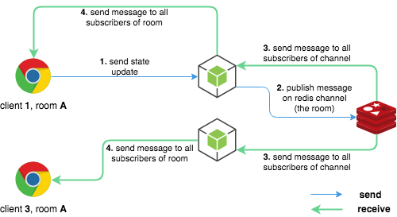

# Events Broadcaster

  

### What?

Library using Redis PubSub to scale a websocket server (such as socket.io, but not exclusively) to more than one instance.

You can check the code in [src/index.js](https://github.com/rbaumier/events-broadcaster/blob/master/src/index.js), it's pretty straightforward.

### Why?

The typical example is a chat application using a socket.io server having a lot of rooms.
If you want to scale this server to more than one instance, you won't be able to directly broadcast messages to all connected clients, because the broadcasting instance won't know about the connected clients on the other instances.

So, you need some sort of mechanism to broadcast events to all the other instances.
This is what this library does using Redis PubSub, you have to:

- listen on `onMessage(callback)` to receive messages from other instances
- call `maybeSubscribe(channel)` when a new client joins
- call `maybeUnsubscribe(channel)` when a client disconnects

with `channel` being your socket.io room (it also works with several rooms per client).
The library will:

- subscribe when needed (only if you aren't already)
- unsubscribe when needed (if the last connected client disconnects: unsubscribe)

That way, each server instance will only listen to the channels/rooms having connected clients.

### How?

Please see the [examples/](https://github.com/rbaumier/events-broadcaster/tree/master/examples/socket.io) folder for a complete working example.

# API

### `maybeSubscribe(channel: string): Promise<void>`

Subscribe to the Redis channel. When subscribed, the `onMessage(f)` callback will be called when receiving messages from this channel.
Internally, we keep a count of how many subscribers we have for each channel. We don't do anything if we are already subscribing to this channel. [See an example.](https://github.com/rbaumier/events-broadcaster/blob/master/examples/socket.io/server.js#L20)

### `maybeUnsubscribe(channel): Promise<void>`

Unsubscribe to the Redis channel if needed. As said in `maybeSubscribe(channel)`, we keep track of how many subscribers we have for each channel. We'll unsubscribe only if the subscriber count for the channel is 0. [See an example.](https://github.com/rbaumier/events-broadcaster/blob/master/examples/socket.io/server.js#L35)

### `publish(channel, message): Promise<void>`

Send a message through the Redis channel via PubSub. Subscribed server instances (including this one) will receive the message via the `onMessage(f)` callback function. [See an example.](https://github.com/rbaumier/events-broadcaster/blob/master/examples/socket.io/server.js#L22)

### `onMessage(f: (channel, message) => any): void`

Listen to new messages and receive the ones sent with the `publish(channel, message)` function. [See an example.](https://github.com/rbaumier/events-broadcaster/blob/master/examples/socket.io/server.js#L9)
